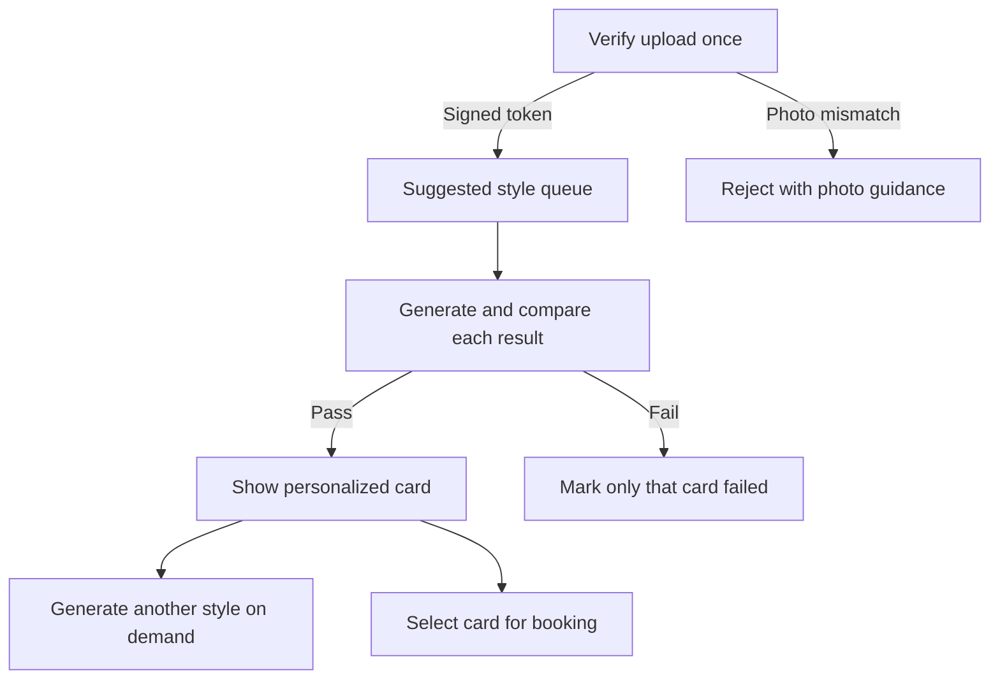

# AI Grooming Preview Architecture

## Purpose

The preview feature applies a selected grooming style to the customer's uploaded pet photo while keeping the result recognizable as the same animal. The backend owns species, season, safety, identity checking, retention, and booking trust decisions.

## User flow

1. Choose Full Grooming or Custom Styling and select a pet.
2. Show a compact Philippine-season banner and upload control before the style gallery.
3. Load all species-compatible styles from `GET /api/ai/styles?petType=dog|cat`; cards initially contain no stock image.
4. Group season-aware suggestions from `POST /api/ai/recommendations` above the remaining compatible choices, then upload a clear photo and consent to processing.
5. Verify once through `POST /api/ai/photo-verification` with a fast profile-blind species model and a stable fallback inside a 30-second overall limit, then receive a signed one-hour token bound to the user, species, and source hash.
6. Generate only the top seasonal suggestion automatically through `POST /api/ai/style-preview`; generate every other card on demand through the same single-request queue.
7. Select a completed card to show the exact same image in Generated style preview.
8. Submit that card's trusted `previewId` with the appointment.

## Backend pipeline



### Identity-preserving prompt constraints

- The upload is the only image reference.
- Preserve species, facial identity, eyes, ears, coat colors and markings, body proportions, pose, camera angle, crop, lighting, and background.
- Apply only the chosen grooming style.
- Apply the selected style's explicit visible definition for coat length, head, muzzle, ears, body, legs, paws, and tail where applicable.
- Do not add accessories, text, extra animals, anatomy, or a replacement background.
- Include the current Manila season and coat-safety note as grooming context.

### Verification layers

| Layer | Input | Decision |
|---|---|---|
| Source verification | Uploaded photo, followed by a server-side species comparison | One profile-blind classifier identifies a clear dog/cat at high confidence and matches the active pet context |
| Fidelity verification | Original plus generated preview and requested style definition | Same identity/species, defining haircut features clearly visible, safe composition |
| Booking verification | Authenticated user, preview record, selected pet/style | Ownership, unexpired record, matching pet/species/breed/style |

## API contracts

### `GET /api/ai/styles?petType=dog`

Returns the compatible style catalog, current server season, and preview-pipeline version. Omitting `petType` returns the full catalog for backward compatibility.

### `POST /api/ai/recommendations`

Request fields:

```json
{
  "serviceId": "full-grooming",
  "petId": "optional-saved-pet-id",
  "petName": "Mochi",
  "petType": "dog",
  "breed": "Shih Tzu",
  "coatType": "long"
}
```

When `petId` is present, the owned database pet is authoritative. The frontend sends it only in Saved Pet mode; New Pet requests always send `petId: null` and use the visible form's name, type, breed, and coat. The server computes the current `Asia/Manila` season and returns up to three ranked compatible styles.

### `POST /api/ai/photo-verification`

Accepts the uploaded photo, consent, service, and pet context. A valid source returns a signed one-hour token. The token contains no image bytes and is bound to the authenticated user, uploaded-photo SHA-256, and species; altering any value invalidates it. This prevents one source-verification charge per style while each generated result still receives its own fidelity check.

Successful response shape:

```json
{
  "success": true,
  "photoVerification": {
    "token": "signed-one-hour-token",
    "sourcePhotoHash": "sha256-of-upload",
    "expiresInSeconds": 3600,
    "verification": {
      "valid": true,
      "detectedAnimal": "dog",
      "policyVersion": "species-v4-neutral-context-bound"
    }
  }
}
```

### `POST /api/ai/style-preview`

Adds `styleId`, `petPhotoDataUrl`, `photoVerificationToken`, and `consent: true` to the pet/service fields above. Older clients without the token still use the original inline verification fallback.

Successful response shape:

```json
{
  "success": true,
  "preview": {
    "previewId": "trusted-preview-id",
    "generatedImage": "data:image/png;base64,...",
    "styleId": "puppy-cut",
    "styleName": "Puppy Cut",
    "previewVersion": "2026-08-pet-fidelity-v5-fast-species-guard:gemini-3.1-flash-image",
    "season": {
      "key": "wet-rainy",
      "label": "Wet/Rainy Season"
    }
  }
}
```

The response also contains internal verification/model metadata for compatibility and diagnostics, but the customer interface intentionally does not display it.

### Appointment creation

The updated frontend sends `aiPreviewId`. The backend loads the generated image from the trusted record and saves it to the appointment with the server-confirmed style, season, model, version, source hash, and fidelity result. Client-supplied legacy `aiPreviewImage` values are rejected because they cannot prove source-photo or species verification.

## Style and season policy

| Style | Species | Hot/Dry | Wet/Rainy | Cool/Dry |
|---|---|---:|---:|---:|
| Puppy Cut | Dog | High | High | Medium |
| Teddy Bear Cut | Dog | Medium | Medium | High |
| Summer Cut | Dog | Suggested and selectable | Selectable | Selectable |
| Asian Fusion | Dog | Low | Medium | High |
| Lion Cut | Cat | High | Medium | Low |
| Comb Cut | Cat | High | High | Selectable |
| Teddy Bear Trim | Cat | Selectable | Selectable | High |
| Natural Trim | Dog, Cat | Medium | High | High |

Availability and priority values live in `backend-express/config/services.js`. Species controls availability; season controls only suggestion badges, order, and explanations. Summer Cut remains selectable outside March–May but is suggested only during Hot/Dry months. For suitable longer-haired cats, Lion Cut is suggested only in Hot/Dry, Comb Cut in Hot/Dry and Wet/Rainy, and Teddy Bear Trim in Cool/Dry. These styles remain selectable outside their recommended seasons with visible coat-suitability notes. Coat conditions remove risky choices from suggestions; a short-haired cat receives only Natural Trim as a seasonal recommendation. Recommendations never override an actual groomer's safety assessment.

Each catalog item also has internal generation instructions and verification criteria. These fields are removed from public style and recommendation responses. They prevent a conservative Natural Trim from being accepted as a uniformly shortened Puppy Cut, and provide equivalent visual boundaries for every dog and cat style.

## Storage, caching, and privacy

- The browser cache is IndexedDB with a seven-day TTL.
- Its key includes source SHA-256, species, normalized breed, style, Manila season, and preview version.
- Preview version `2026-08-pet-fidelity-v5-fast-species-guard` and browser cache namespace `v7-fast-species-guard-cache` prevent results from earlier source-verification policies from being reused.
- Temporary `AiPreview` records use MongoDB TTL expiration, defaulting to seven days.
- Large image and hash fields use `select: false` so lists do not return them accidentally.
- Appointments retain the chosen image for groomer reference after the temporary record expires.
- Only authenticated owners can generate or attach a preview.
- Source verification is performed once per fresh upload; the signed token is valid for one hour and is never stored as an appointment field.
- Source classification is profile-blind: neither the low-latency primary model nor the stable fallback sees the selected species value. Server code alone requires the returned high-confidence species to match the active pet context.
- Verification tokens and preview records carry a source-policy version. Older tokens and preview records cannot be reused or booked after this policy change.
- The browser permits only one active style request. Vertex capacity errors return `AI_QUOTA_EXHAUSTED` immediately without an automatic repeat, and successful cards remain preserved for an explicit later retry.
- Google credentials remain on the Express server.

## Operational notes

- Increment `AI_PREVIEW_VERSION` whenever prompts, fidelity policy, or image models materially change.
- Keep `AI_FIDELITY_CHECK_ENABLED=true` in production.
- Monitor `422` source-mismatch and fidelity-failure rates to improve upload guidance and prompts.
- The default 240-second route timeout is a safety ceiling. Normal configuration performs one generation plus one post-generation check; a failed check is retried only when the customer requests it.
- AI preview output is a visual estimate, never a promise of the physical grooming result.
